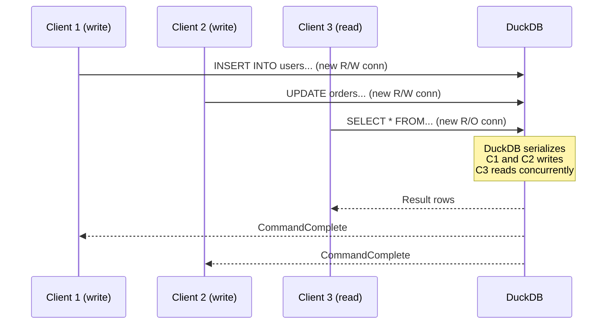

# Section 3: Architecture

## 3.1 Overview

mallardb operates as a protocol translation layer between PostgreSQL clients and a DuckDB storage engine. The architecture separates connection handling, query routing, and execution into distinct components.

### Figure 3-1: High-Level Architecture

```
┌─────────────────────────────────────────────────────────────────┐
│                         mallardb Server                         │
├─────────────────────────────────────────────────────────────────┤
│  ┌───────────────────────────────────────────────────────────┐  │
│  │                    pgwire Frontend                        │  │
│  │  ┌─────────────┐  ┌─────────────┐  ┌─────────────┐       │  │
│  │  │   Auth      │  │  Catalog    │  │    Type     │       │  │
│  │  │  Handler    │  │  Emulator   │  │   Mapper    │       │  │
│  │  └─────────────┘  └─────────────┘  └─────────────┘       │  │
│  └───────────────────────────────────────────────────────────┘  │
│                              │                                   │
│                              ▼                                   │
│  ┌───────────────────────────────────────────────────────────┐  │
│  │                    Query Router                           │  │
│  │                                                           │  │
│  │   Write Role ──────────────► R/W DuckDB Connection        │  │
│  │   Read Role  ──────────────► R/O DuckDB Connection        │  │
│  └───────────────────────────────────────────────────────────┘  │
│                              │                                   │
│                              ▼                                   │
│  ┌───────────────────────────────────────────────────────────┐  │
│  │                Per-Query DuckDB Connections               │  │
│  │                                                           │  │
│  │   Each query gets a fresh connection. DuckDB handles      │  │
│  │   write serialization internally via WAL and locking.     │  │
│  │                                                           │  │
│  │   ┌─────────┐ ┌─────────┐ ┌─────────┐ ┌─────────┐        │  │
│  │   │  Conn   │ │  Conn   │ │  Conn   │ │  Conn   │        │  │
│  │   │  (R/W)  │ │  (R/W)  │ │  (R/O)  │ │  (R/O)  │        │  │
│  │   └────┬────┘ └────┬────┘ └────┬────┘ └────┬────┘        │  │
│  │        │           │           │           │              │  │
│  └────────┼───────────┼───────────┼───────────┼──────────────┘  │
│           └───────────┴─────┬─────┴───────────┘                 │
│                             ▼                                   │
│                    ┌─────────────────┐                          │
│                    │   DuckDB File   │                          │
│                    │   (data.db)     │                          │
│                    └─────────────────┘                          │
└─────────────────────────────────────────────────────────────────┘
```

*Figure 3-1 illustrates the layered architecture of mallardb, showing protocol handling, query routing, and per-connection DuckDB access.*

## 3.2 Components

### 3.2.1 pgwire Frontend

The pgwire frontend handles all PostgreSQL wire protocol communication:

- **Connection acceptance**: TCP listener on configurable port (default 5432)
- **TLS negotiation**: Optional TLS upgrade via `SSLRequest`
- **Startup handling**: Parse `StartupMessage`, extract parameters
- **Authentication**: Validate credentials against configured roles
- **Message processing**: Parse client messages, dispatch to appropriate handlers
- **Response formatting**: Encode DuckDB results as PostgreSQL wire format

The frontend MUST implement the following PostgreSQL message types:

| Message | Direction | Purpose |
|---------|-----------|---------|
| StartupMessage | C→S | Initial connection with parameters |
| SSLRequest | C→S | Request TLS upgrade |
| PasswordMessage | C→S | Authentication response |
| Query | C→S | Simple query protocol |
| Parse | C→S | Prepared statement creation |
| Bind | C→S | Parameter binding |
| Execute | C→S | Execute prepared statement |
| Describe | C→S | Describe statement/portal |
| Sync | C→S | Sync point for extended query |
| Terminate | C→S | Connection close |
| AuthenticationOk | S→C | Auth success |
| AuthenticationCleartextPassword | S→C | Request password |
| ParameterStatus | S→C | Server parameter notification |
| BackendKeyData | S→C | Cancellation key |
| ReadyForQuery | S→C | Transaction status |
| RowDescription | S→C | Column metadata |
| DataRow | S→C | Result row |
| CommandComplete | S→C | Statement completion |
| ErrorResponse | S→C | Error with SQLSTATE |
| NoticeResponse | S→C | Warning/info |

### 3.2.2 Catalog Emulator

The catalog emulator intercepts queries to PostgreSQL system catalogs and translates them to equivalent DuckDB queries or returns synthesized results. See [Section 6](./06-catalog.md) for complete catalog coverage.

The emulator MUST:

1. Detect queries targeting `pg_catalog.*` or `information_schema.*`
2. Translate supported queries to DuckDB equivalents
3. Synthesize responses for PostgreSQL-specific catalogs with no DuckDB equivalent
4. Pass through non-catalog queries unchanged

### 3.2.3 Type Mapper

The type mapper translates between DuckDB types and PostgreSQL type OIDs. See [Section 8](./08-type-system.md) for the complete mapping table.

### 3.2.4 Query Router

The query router determines which DuckDB connection handles each query based on the authenticated role:

- **Write role connections**: Create read-write DuckDB connections
- **Read role connections**: Create read-only DuckDB connections

The router does NOT parse queries to determine read vs write intent. Routing is purely role-based.

### 3.2.5 Per-Connection Model

Each query creates a fresh DuckDB connection:

- **Write connections**: Full read-write access, DuckDB manages serialization
- **Read connections**: Read-only mode, fully concurrent

This design leverages DuckDB's native concurrency model:

> Within a single process, DuckDB supports multiple writer connections using a combination of MVCC and optimistic concurrency control.

Implementation details:

- DuckDB uses `wait_for_write_lock` internally to serialize writes
- Read connections use `AccessMode::ReadOnly` flag
- Each connection has its own transaction context (no cross-client interference)
- Auto-rollback on error prevents "transaction aborted" deadlock states

### Figure 3-2: Concurrent Query Execution



*Figure 3-2 shows how concurrent queries are handled with DuckDB managing write serialization internally.*

## 3.3 Connection Lifecycle

### Figure 3-3: Connection State Machine


*Figure 3-3 shows the connection states from initial TCP accept through authentication to query processing.*

## 3.4 Data Directory Structure

mallardb stores all persistent data in a single directory:

```
/var/lib/mallardb/
├── data.db           # Primary DuckDB database file
├── data.db.wal       # DuckDB write-ahead log (if enabled)
└── mallardb.conf     # Optional configuration (future)
```

The data directory MUST be:
- Writable by the mallardb process
- Mounted as a Docker volume for persistence
- Owned by the mallardb process user (UID configurable)
