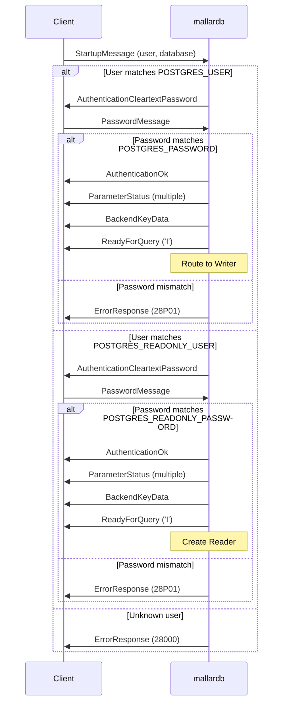

# Section 5: Authentication

## 5.1 Overview

mallardb implements a simplified authentication model with two predefined roles: a read-write role and a read-only role. Authentication credentials are configured via environment variables, following PostgreSQL Docker image conventions.

## 5.2 Role Configuration

### 5.2.1 Write Role

The write role is configured via:

| Variable | Required | Description |
|----------|----------|-------------|
| `POSTGRES_USER` | Yes | Username for read-write access |
| `POSTGRES_PASSWORD` | Yes | Password for read-write user |

The write role:
- Has full read and write access to all objects
- Routes all queries through the shared writer
- Can execute DDL, DML, and queries

### 5.2.2 Read Role

The read role is configured via:

| Variable | Required | Description |
|----------|----------|-------------|
| `POSTGRES_READONLY_USER` | No | Username for read-only access |
| `POSTGRES_READONLY_PASSWORD` | No | Password for read-only user |

If `POSTGRES_READONLY_USER` is not set, read-only access is disabled.

The read role:
- Can only execute read operations (SELECT, SHOW, DESCRIBE, etc.)
- Gets a dedicated DuckDB reader connection
- Receives an error on any write attempt

### 5.2.3 Default Database

The default database name is configured via:

| Variable | Required | Default | Description |
|----------|----------|---------|-------------|
| `POSTGRES_DB` | No | Same as `POSTGRES_USER` | Database name for connection |

Since mallardb supports only a single database, this value is used for:
- Validating the `database` parameter in `StartupMessage`
- Populating `current_database()` responses
- Catalog queries

## 5.3 Authentication Methods

### 5.3.1 Cleartext Password (Initial Implementation)

The initial implementation uses cleartext password authentication:

1. Server sends `AuthenticationCleartextPassword`
2. Client sends `PasswordMessage` with password
3. Server compares against configured credential
4. Server sends `AuthenticationOk` or `ErrorResponse`

> **Note:** Cleartext password is acceptable when TLS is enabled. Production deployments SHOULD use TLS.

### 5.3.2 MD5 Password (Future)

MD5 authentication MAY be implemented in future versions:

1. Server sends `AuthenticationMD5Password` with 4-byte salt
2. Client sends `PasswordMessage` with `md5(md5(password + user) + salt)`
3. Server validates hash

### 5.3.3 SCRAM-SHA-256 (Future)

SCRAM-SHA-256 authentication MAY be implemented in future versions following RFC 5802.

## 5.4 Authentication Flow

### Figure 5-1: Authentication Sequence



*Figure 5-1 shows the authentication sequence for both write and read roles.*

## 5.5 Error Codes

Authentication errors MUST use these SQLSTATE codes:

| Code | Condition |
|------|-----------|
| 28000 | Invalid authorization specification (unknown user) |
| 28P01 | Invalid password |
| 28001 | Invalid credentials (generic) |

## 5.6 Future: Role Management

Future versions MAY support dynamic role management:

```sql
-- Future syntax (not in initial release)
CREATE ROLE analyst WITH PASSWORD 'secret' READONLY;
ALTER ROLE analyst SET search_path = 'analytics';
DROP ROLE analyst;
GRANT SELECT ON TABLE metrics TO analyst;
```

The architecture SHOULD accommodate future role storage in:
- A dedicated DuckDB table (`mallardb.roles`)
- Password hashes, not plaintext
- Role attributes (readonly, superuser, etc.)

## 5.7 Connection Limits

mallardb MAY enforce connection limits:

| Limit | Default | Description |
|-------|---------|-------------|
| Max write connections | Unlimited | Concurrent write role connections |
| Max read connections | Unlimited | Concurrent read role connections |
| Max readers | 64 | Maximum DuckDB reader instances |

When limits are exceeded, mallardb MUST return:
- SQLSTATE `53300` (too_many_connections)
- Message: "too many connections for role \"{role}\""

## 5.8 Session Tracking

For each authenticated connection, mallardb MUST track:

| Field | Description |
|-------|-------------|
| Process ID | Unique identifier for BackendKeyData |
| Secret Key | Random 32-bit value for cancellation |
| Username | Authenticated role name |
| Role Type | Write or Read |
| Connected At | Timestamp |
| Application Name | From startup parameters |
| Client Address | Remote IP:port |

This information is used for:
- Query cancellation
- Monitoring (future `pg_stat_activity` emulation)
- Logging
