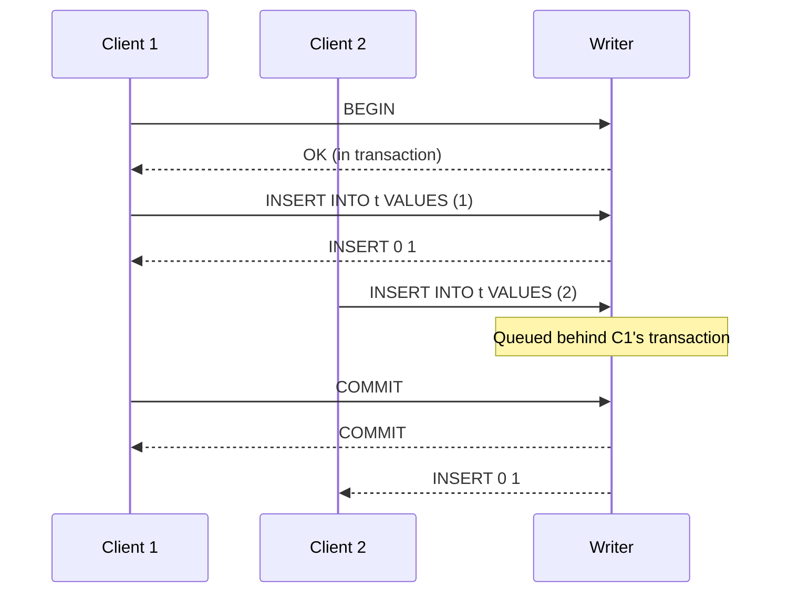

# Section 9: Transactions

## 9.1 Overview

mallardb supports PostgreSQL transaction semantics while working within DuckDB's concurrency model. This section specifies how transactions are handled for both write and read connections.

## 9.2 DuckDB Transaction Model

DuckDB provides:
- ACID transactions
- MVCC (Multi-Version Concurrency Control) for reads
- Single writer at a time (serialized writes)
- Snapshot isolation for readers

mallardb's transaction implementation builds on these guarantees.

## 9.3 Auto-Commit Mode

By default, mallardb operates in auto-commit mode:
- Each statement executes in its own implicit transaction
- Statements are committed immediately upon completion
- No explicit `BEGIN` required

This matches PostgreSQL's default behavior outside of explicit transaction blocks.

## 9.4 Explicit Transactions

### 9.4.1 Write Role Transactions

For write role connections, explicit transactions work as follows:

```sql
BEGIN;                    -- Start transaction
INSERT INTO t VALUES (1); -- Queued to writer
UPDATE t SET x = 2;       -- Queued to writer
COMMIT;                   -- Queued to writer, commits
```

**Behavior:**
- `BEGIN` marks the connection as "in transaction"
- Subsequent statements from this connection are grouped
- All statements execute serially through the writer queue
- `COMMIT` or `ROLLBACK` ends the transaction block

**Important constraint:** Because all writes serialize through a single writer, long-running transactions from one connection block writes from other connections. Applications SHOULD keep transactions short.

### 9.4.2 Transaction Pinning

Once a write connection begins an explicit transaction:
1. All queries from that connection go to the writer (already true for write role)
2. The writer maintains transaction state for that connection
3. No other connection's transaction can interleave

### Figure 9-1: Write Transaction Serialization



*Figure 9-1 shows how a second client's write waits for the first client's transaction to complete.*

### 9.4.3 Read Role Transactions

Read role connections can use explicit transactions for snapshot isolation:

```sql
BEGIN;                    -- Start snapshot
SELECT * FROM t;          -- Sees consistent snapshot
SELECT * FROM t;          -- Same snapshot
COMMIT;                   -- Release snapshot
```

**Behavior:**
- `BEGIN` acquires a read snapshot
- All queries see the database as of that snapshot
- Changes from concurrent writers are not visible
- `COMMIT` or `ROLLBACK` releases the snapshot
- Write statements return an error

### 9.4.4 Read-Only Transactions

mallardb accepts `BEGIN READ ONLY`:

```sql
BEGIN READ ONLY;          -- Explicit read-only transaction
BEGIN TRANSACTION READ ONLY;
START TRANSACTION READ ONLY;
```

For read roles, this is equivalent to `BEGIN`. For write roles, this restricts the transaction to read operations.

## 9.5 Transaction State Machine

### Figure 9-2: Transaction States


*Figure 9-2 shows the transaction state transitions.*

## 9.6 ReadyForQuery Status

The `ReadyForQuery` message includes transaction status:

| Status | Meaning |
|--------|---------|
| `I` | Idle (not in transaction) |
| `T` | In transaction block |
| `E` | In failed transaction block |

mallardb MUST send the correct status after each command.

## 9.7 Savepoints

Savepoints are NOT supported in the initial implementation.

```sql
SAVEPOINT sp1;           -- Returns error
ROLLBACK TO sp1;         -- Returns error
RELEASE sp1;             -- Returns error
```

Error: SQLSTATE `0A000` (feature_not_supported), Message: "savepoints are not supported"

Future versions MAY implement savepoints if DuckDB support allows.

## 9.8 Transaction Isolation Levels

mallardb accepts but normalizes isolation level settings:

```sql
SET TRANSACTION ISOLATION LEVEL READ COMMITTED;  -- Accepted
SET TRANSACTION ISOLATION LEVEL REPEATABLE READ; -- Accepted
SET TRANSACTION ISOLATION LEVEL SERIALIZABLE;    -- Accepted
BEGIN ISOLATION LEVEL SERIALIZABLE;              -- Accepted
```

**Actual behavior:** All transactions run at DuckDB's snapshot isolation level, which is between REPEATABLE READ and SERIALIZABLE in PostgreSQL terms.

mallardb SHOULD return the configured isolation level in response to:
```sql
SHOW transaction_isolation;  -- Returns configured value
```

## 9.9 Error Handling in Transactions

### 9.9.1 Error in Transaction Block

When an error occurs inside a transaction:

1. The transaction enters the "failed" state
2. Subsequent queries return: "current transaction is aborted, commands ignored until end of transaction block"
3. Only `ROLLBACK` is accepted
4. `ROLLBACK` returns transaction to idle state

### 9.9.2 Example

```sql
BEGIN;
INSERT INTO t VALUES (1);      -- OK
INSERT INTO t VALUES ('bad');  -- Type error
-- Transaction now in failed state
SELECT 1;                      -- ERROR: current transaction is aborted
ROLLBACK;                      -- OK, returns to idle
```

## 9.10 Connection Termination

When a connection terminates:

### 9.10.1 In Transaction

If the connection had an open transaction:
- Implicit `ROLLBACK` is performed
- Uncommitted changes are discarded
- Writer queue processes the rollback

### 9.10.2 Idle

If the connection was idle:
- No transaction cleanup needed
- Connection resources freed

## 9.11 Lock Wait Timeout

Because writes serialize through a single writer, there are no traditional lock waits. However, the writer queue itself acts as a serialization point.

| Setting | Default | Description |
|---------|---------|-------------|
| `mallardb_LOCK_TIMEOUT_MS` | 30000 | Maximum time waiting in writer queue |

When timeout expires:
- SQLSTATE `55P03` (lock_not_available)
- Message: "canceling statement due to lock timeout"

## 9.12 Two-Phase Commit

Two-phase commit (prepared transactions) is NOT supported:

```sql
PREPARE TRANSACTION 'txn1';  -- Returns error
COMMIT PREPARED 'txn1';      -- Returns error
ROLLBACK PREPARED 'txn1';    -- Returns error
```

Error: SQLSTATE `0A000` (feature_not_supported), Message: "prepared transactions are not supported"
